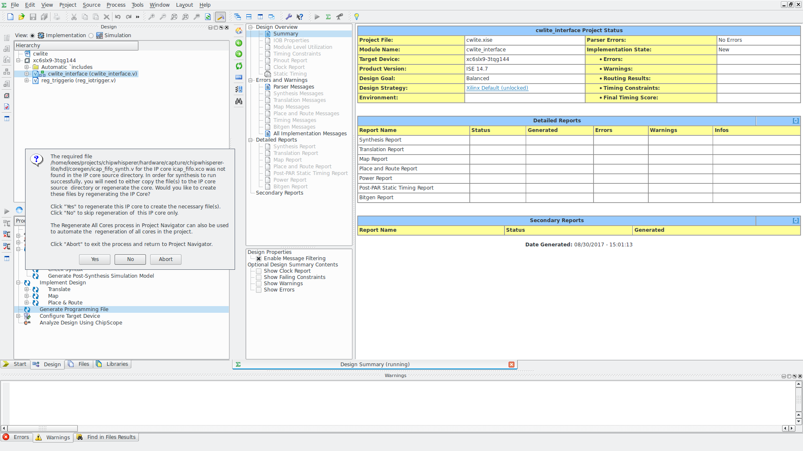
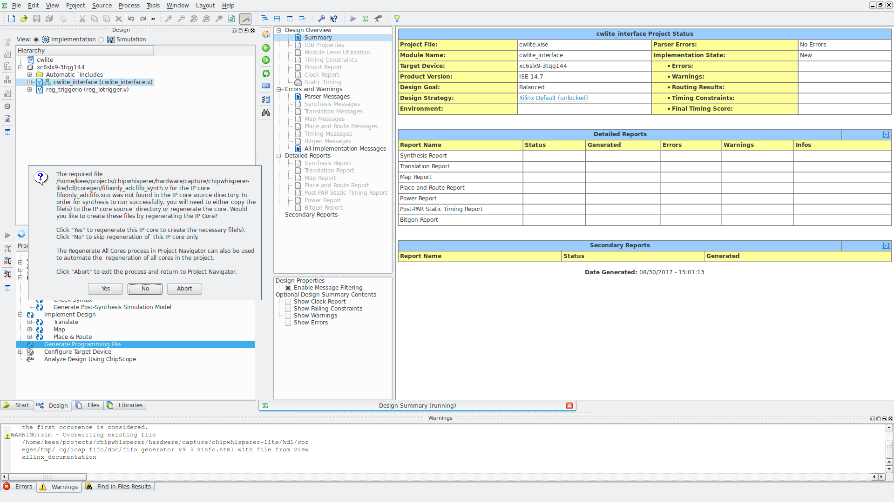
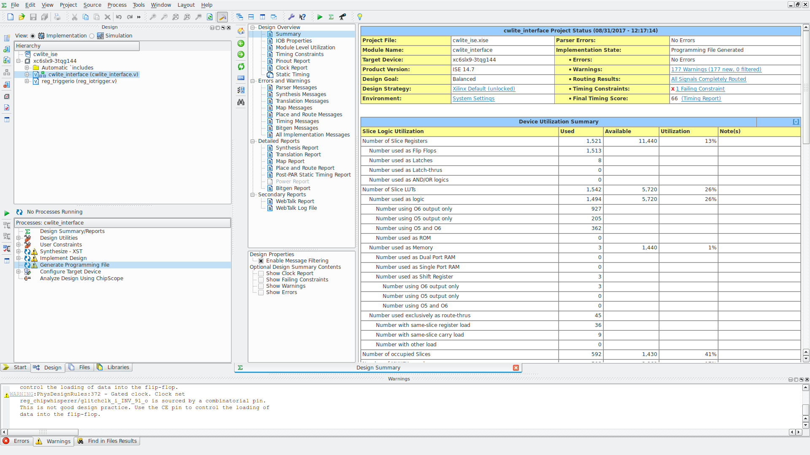

# ChipWhisperer building the firmware

The ChipWhispere FPGA firmware can be built from within the normal source tree.

as per https://github.com/newaetech/chipwhisperer/issues/69

## Prerequisites

The ChipWhisperer lite (CW from now on) contains an Xilinx series FPGA 6SLX9TQG144
FPGA. To be able to compile this code you need to download the xilinx websuite. This is older software still works nice for the 6 series FGPA's.

Setup the environemnt by sourcing /opt/Xilinx/14.7/ISE_DS/.settings64.sh

    kees@nb-:/opt/Xilinx/14.7/ISE_DS$ . settings64.sh 
    . /opt/Xilinx/14.7/ISE_DS/common/.settings64.sh /opt/Xilinx/14.7/ISE_DS/common
    . /opt/Xilinx/14.7/ISE_DS/EDK/.settings64.sh /opt/Xilinx/14.7/ISE_DS/EDK
    . /opt/Xilinx/14.7/ISE_DS/PlanAhead/.settings64.sh /opt/Xilinx/14.7/ISE_DS/PlanAhead
    . /opt/Xilinx/14.7/ISE_DS/ISE/.settings64.sh /opt/Xilinx/14.7/ISE_DS/ISE

Next you need to make sure the openadc is also checkout at it contains the makeise scipts to generated configuration files for the ise IDE

Once this is done you can execute makeise in the following folder (there is also a makeprojects_win.bat file with this command)

    kees@domain:~/projects/chipwhisperer/hardware/capture/chipwhisperer-lite/hdl$ ../../../../openadc/hdl/makeise/makeise.py cwlite.in cwlite_ise/cwlite_ise.xise
    Using cwlite.in input file to make cwlite_ise/cwlite_ise.xise

    FPGA = Spartan6 xc6slx9 in tqg144-3
    **Verilog Sources:
    cwlite_interface.v
    ../../../../common/hdl/reg_main_cwlite.v
    setup.v
    ../../../../../openadc/hdl/hdl/openadc_interface.v
    ../../../../../openadc/hdl/hdl/reg_openadc.v
    ../../../../../openadc/hdl/hdl/reg_openadc_adcfifo.v
    ../../../../../openadc/hdl/hdl/trigger_unit.v
    ../../../../../openadc/hdl/hdl/spartan6/dcm_phaseshift_interface.v
    ../../../../../openadc/hdl/hdl/spartan6/clock_managment_advanced.v
    ../../../../../openadc/hdl/hdl/spartan6/dcm_clkgen_load.v
    ../../../../common/hdl/clockglitch/clockglitch_s6.v
    ../../../../common/hdl/clockglitch/reg_clockglitch.v
    ../../../../common/hdl/clockglitch/trigger_resync.v
    ../../../../common/hdl/io_trigger/reg_iotrigger.v
    ../../../../common/hdl/io_trigger/trigger_system.v
    ../../../../common/hdl/reg_chipwhisperer.v
    ../../../../common/hdl/reconfig/reg_reconfig.v
    ../../../../common/hdl/fifo_stream/fifo_top_stream.v
    **UCF Files:
    cwlite_lx9_tqfp144.ucf
    **XCO Files:
    fifoonly_adcfifo.xco
    icap_fifo.xco

and open the file ise ise cwlite.xise.

    ise cwlite_ise/cwlite_ise.xise 

In the design tab select "generate programming file" to compile the HDL code. You will be prompted to launch the IP core generator twice during this process.

        

# Creating the partial files

    kees@domain:~/projects/chipwhisperer/hardware/capture/chipwhisperer-lite/hdl$ python generate_reconfig_dicts.py

you end up with new files

    kees@domain:~/projects/chipwhisperer/hardware/capture/chipwhisperer-lite/hdl$ find . -name "*.p"
    ./cwlite-glitchwidth.p
    ./cwlite-glitchoffset.p

    mkdir zip
    cp *.p zip/
    cp cwlite_ise/cwlite_interface.bit zip/
    cd zip
    zip  ../../cwlite_kees.zip *
    adding: cwlite-glitchoffset.p (deflated 70%)
    adding: cwlite-glitchwidth.p (deflated 72%)
    adding: cwlite_interface.bit (deflated 86%)

From within CW capture software, point to the .zip file you made as the CW-Lite firmware.

The files I ended up with have the same sha1sum as the originals

    kees@domain:~/projects/chipwhisperer/hardware/capture/chipwhisperer-lite/hdl$ sha1sum zip/*.p zip2/*.p
    57290308f7beb7f4909e93231d5f65b0a96dc4d8  zip/cwlite-glitchoffset.p
    1f43d77fe907f7eb87067f4b848affdc1edb0ded  zip/cwlite-glitchwidth.p
    57290308f7beb7f4909e93231d5f65b0a96dc4d8  zip2/cwlite-glitchoffset.p
    1f43d77fe907f7eb87067f4b848affdc1edb0ded  zip2/cwlite-glitchwidth.p

https://www.xilinx.com/support/documentation/sw_manuals/xilinx14_4/PlanAhead_Tutorial_Partial_Reconfiguration.pdf

# Building the SAM3U firmware

It looks like the tool to use is windows based and called Atmel studio.
There is also a Linux port of the ARM compilers we are going to try and use.

Posted question here: https://forum.newae.com/viewtopic.php?f=6&t=386

It is possible to build the Firmware under linux but this requires a little hacking of Makefiles.
http://www.microchip.com/development-tools/atmel-studio-7/avr-and-arm-toolchains-(c-compilers)

# install gcc-arm-none-eabi

On debian first install the gcc-arm-none-eabi package (it contains support for the M4 series ARM processors)

	sudo apt-get install gcc-arm-none-eabi

And follow run make -f Makefile.linux under hardware/capture/chipwhisperer-lite/sam3u_fw/SAM3U_VendorExample/Debug
Next flash the resulting firmware (after erasing the firmware) using bossac-lin32 found in ../../bossa/ 
e.g. 

./bossac-lin32  -i
Device found on ttyACM0
Device       : ATSAM3U2
Chip ID      : 280a0761
Version      : v1.1 Oct 16 2008 17:28:07
Address      : 524288
Pages        : 512
Page Size    : 256 bytes
Total Size   : 128KB
Planes       : 1
Lock Regions : 16
Locked       : none
Security     : false
Boot Flash   : false
https://wiki.newae.com/Manual_SAM3U_Firmware_Update
